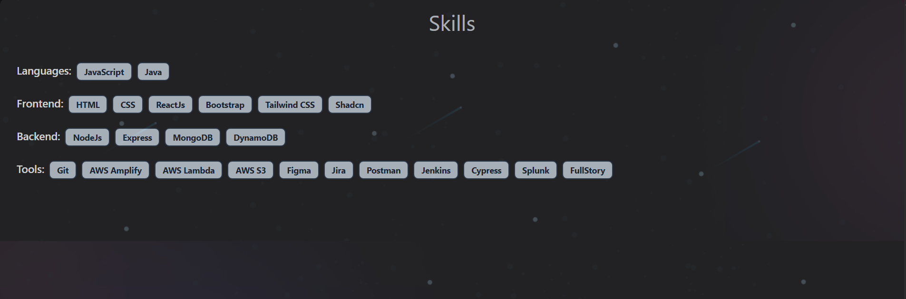

# Shubham Talreja - Developer Portfolio

Welcome to my personal developer portfolio! This project showcases my skills, experience, and projects in a modern, responsive web application built with React, Vite, and Tailwind CSS.

## 🚀 Features
- **Home**: Introduction and banner section
- **Skills**: Technologies and tools I use
- **Projects**: Highlights of my work with images
- **About/Experience**: My professional journey
- **Contact**: Quick links to connect

## 🖼️ Screenshots
| Home | Skills | Projects |
|------|--------|---------|
|  |  |  |

## 🛠️ Tech Stack
- React
- Vite
- Tailwind CSS
- JavaScript

## 📦 Setup & Development
1. **Clone the repo**
	```sh
	git clone https://github.com/shubhamtalreja/Portfolio.git
	cd Portfolio
	```
2. **Install dependencies**
	```sh
	npm install
	```
3. **Start the development server**
	```sh
	npm run dev
	```
4. **Build for production**
	```sh
	npm run build
	```

## 📁 Folder Structure
```
Portfolio/
├── src/
│   ├── assets/img/        # Images used in the portfolio
│   ├── components/        # React components for each section
│   ├── App.jsx            # Main app component
│   ├── index.jsx          # Entry point
│   └── ...
├── public/
├── index.html
├── tailwind.config.js
├── vite.config.js
└── ...
```

## 🙋‍♂️ About Me
I'm Shubham Talreja, a passionate developer eager to build impactful web experiences. Connect with me on [LinkedIn](https://www.linkedin.com/in/shubham-talreja-b04697205/).

---
Feel free to explore the code, suggest improvements, or reach out for collaboration!
